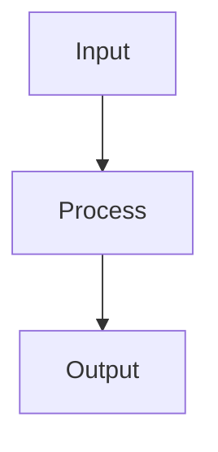

# FEATURE_NAME

## Summary
[One-line description of the feature]

## Purpose
[Why this feature exists and what problem it solves]

## User / System Value
- [Value 1]
- [Value 2]

## Entry Points
- `src/`
- `src/`

## Behavior
[How the feature works - main flows and logic]

## Key Components
- **Component1**: [description]
- **Component2**: [description]

## Data Flow

## Configuration
[Any settings, env vars, or configuration needed]

## Dependencies
- [Package/Service 1]
- [Package/Service 2]

## Edge Cases / Constraints
- [Known limitation 1]
- [Known limitation 2]

## Evidence
- Implementation: `src/path/to/file.cs`
- Tests: `test/path/to/test.cs`

## Gaps
- [Missing tests]
- [Known TODOs]

## Related Docs
- [Related Feature](./related-feature.md)